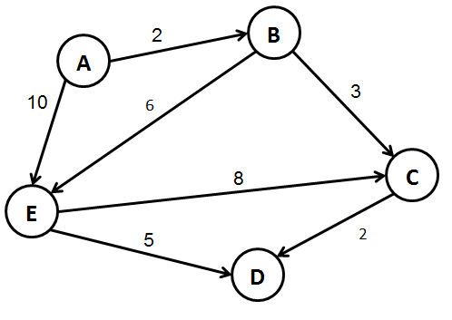
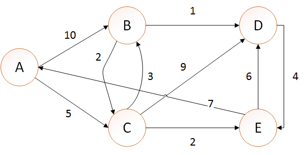

# Dijkstra
Atividade da matéria de Grafos. Implementação de Dijkstra. Quando executa o código ele dará dois resultados, o primeiro é referente a primeira imagem base.png e o segundo resultado é correspondnte a segunda imagem.

# Base 1

# Base 2 

